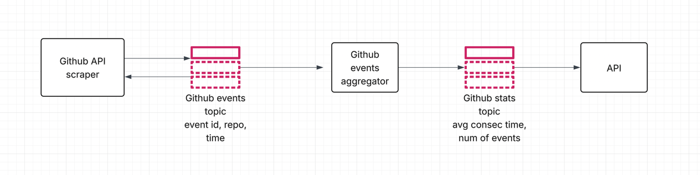

## Infrastructure
I was deciding which infrastructure to choose for this project. I could think of 3 options:

### Option 1.
Option 1 was to build 2 - 3 separate microservices that'd be communicating through an event based database,
like Apache Kafka. 

This type of pipeline is very scalable, as it'd allow multiple scrapers, aggregators and APIs for maximum scalability.
The apps would be independent and could handle thousands of repos. This approach would be overkill for this type
of exercise, but not a bad idea for greater usage.

### Option 2.
Option 2 and what I've chosen in the end is 2 apps that share 1 SQL database.

It didn't require that much setup, as SQL database can run in the docker easily, and still has some scalability.
The apps are not completely independent, as they have shared code, but that's more of an advantage for this pipeline,
as there's less code duplication and only 1 SQL table model. 

It has both combined configuration for database, and separate configuration for each app. It can be deployed separately
as 1 docker container is created per app.

### Option 3.
The third option I was considering was to make 1 monolithic app. To either store the Github events to a file or SQL database.
It would only have 1 config and 2 processes, scraping + aggregation and API endpoints.

It would certainly be the easiest to implement, but would be less scalable and independent. It wasn't a bad option to pick,
as requirements were minimal for this app, but it could be challenging to expand it further and the app would be heavy-weight.

## Event scraper app

I've decided to make a separate configuration for the scraper, in case someone wanted to store info for some repos, but
not show them to the public. The events from the database are deleted after 7 days. This setting could be always prolonged
for archival purposes.

### Rate limits
Github does have some rate limits, but they're generally quite high, with using the authorization token. Github does
return those limits, but I've decided to ignore them for saving more time.

### Tests
I've developed some tests, but due to time constrains I've skipped tests for the github_event_wrapper class (and github client).
I've instead tested the most critical section which is the github scraper client.

I've also decided to put shared (mainly database related) code and config to shared_resources. This does make it more
difficult to develop apps independently, but it reduces code duplication. It also doesn't let us to have multiple models
for the same database.

Scraper app also assumes that the Github response is always sorted by created_at time.

## Github events API
I've decided to go with the Fastapi infrastructure, as it's a very popular choice nowadays due to simplicity and speed of it.

There are 2 threads running, 1 provides endpoint responses, and second periodically fetches the Github events database and
aggregates the stats. It's generally a better approach than calculating them on request, because it's non-blocking and provides
faster responses. It also potentially minimizes cost as querying the database on each request could be costly.

The database querying is improved to only load maximum of 100 events to memory at once in case there were RAM issues. We also
stop querying if we see an event older than 7 days (configurable).

